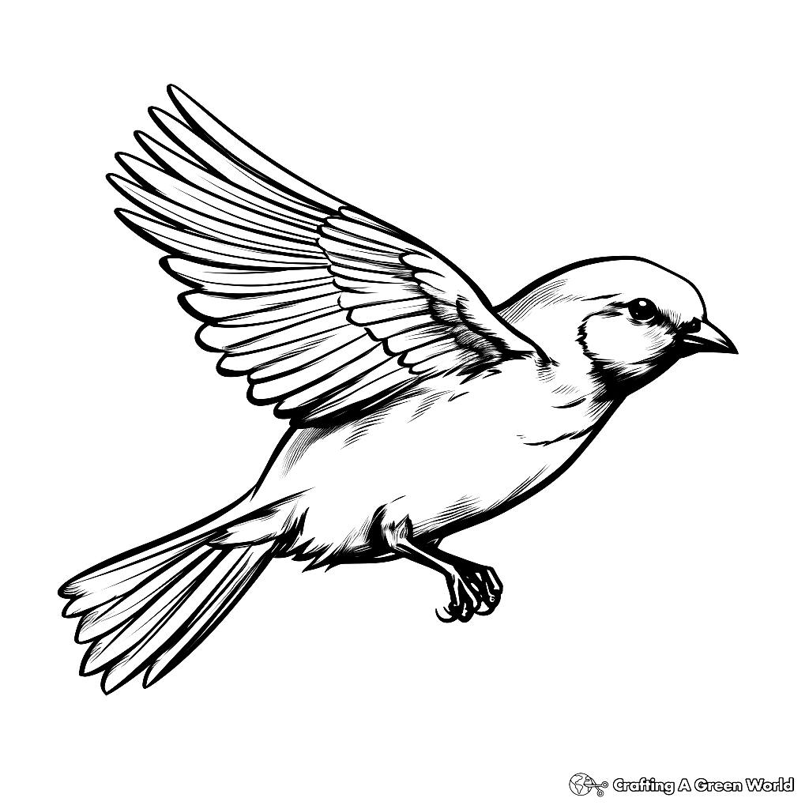
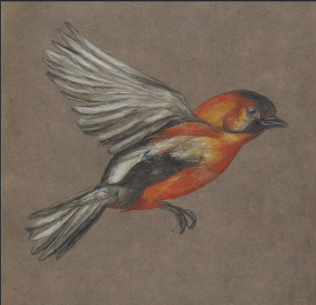
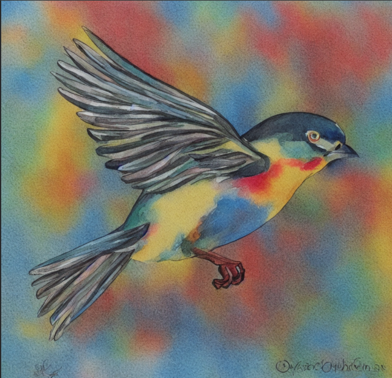
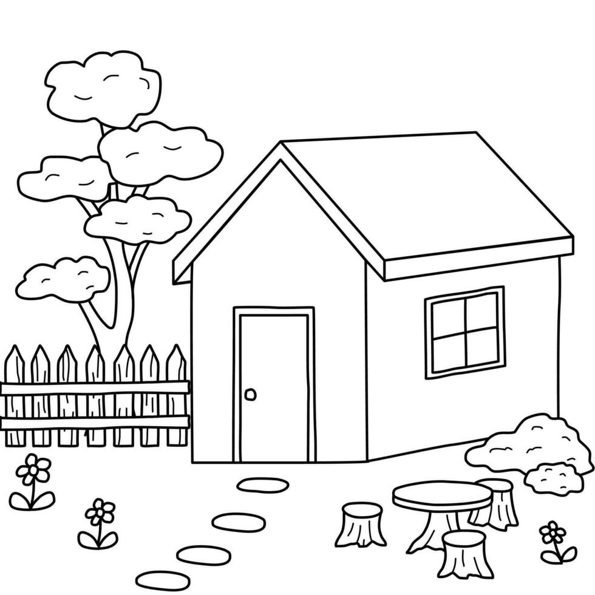
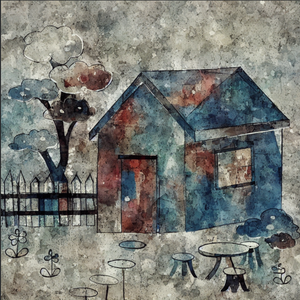
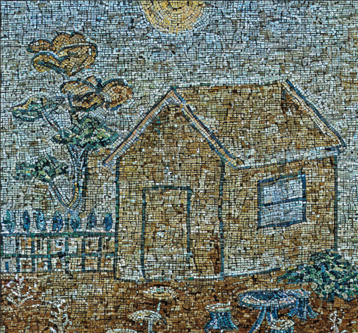

# Sketch to Art Generator

)

A Generative AI project that transforms sketches into artistic images using Stable Diffusion and ControlNet.

## Technologies Used

- Python
- PyTorch
- Diffusers
- Transformers
- Stable Diffusion
- ControlNet
- Google Colab

## Example 1: Bird

### Input

### Oil Pastel Output

### Watercolor Output

## Example 2: House

### Input

### Abstract Output

### Mosaic Output

## Author

Dhanush HM
